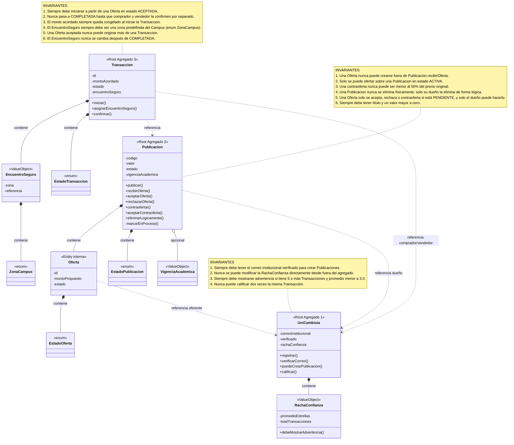

# Modelo de Agregados — UniSegundaMano

Este documento describe los Agregados del dominio, sus raíces, sus métodos de negocio y las invariantes que protegen, siguiendo el patrón de Domain-Driven Design aplicado en el proyecto.

## Diagrama

## Los 3 Agregados

### Agregado 1 — UniCambista (raíz)

**Contiene:** `RachaConfianza` (Value Object)

**Métodos de negocio:** `registrar()`, `verificarCorreo()`, `puedeCrearPublicacion()`, `calificar()`

**Invariantes que protege:**
1. Siempre debe tener el correo institucional verificado para crear Publicaciones.
2. Nunca se puede modificar la `RachaConfianza` directamente desde fuera del agregado.
3. Siempre debe mostrarse una advertencia si tiene 5 o más Transacciones y un promedio menor a 3.0.
4. Nunca puede calificar dos veces la misma Transacción (lo registra `Transaccion.registrarCalificacionDe`).

### Agregado 2 — Publicacion (raíz)

**Contiene:** `Oferta` (entidad interna, no accesible desde afuera del agregado), `EstadoPublicacion` (enum), `VigenciaAcademica` (Value Object opcional)

**Referencia (no contiene):** `UniCambista` (dueño de la publicación)

**Métodos de negocio:** `publicar()`, `recibirOferta()`, `aceptarOferta()`, `rechazarOferta()`, `contraofertar()`, `aceptarContraoferta()`, `eliminarLogicamente()`. `marcarEnProceso()` es privado: solo la raíz lo invoca al aceptarse una Oferta o contraoferta.

**Invariantes que protege:**
1. Una `Oferta` nunca puede crearse fuera de `Publicacion.recibirOferta(...)`; el método `Oferta.crear(...)` es package-private, por lo que ninguna clase externa puede invocarlo directamente.
2. Solo se puede ofertar sobre una Publicación en estado `ACTIVA`.
3. Una contraoferta nunca puede ser menor al 50% del precio original.
4. Una Publicación nunca se elimina físicamente: solo su dueño puede eliminarla de forma lógica.
5. Una Oferta solo se acepta, rechaza o contraoferta mientras está `PENDIENTE`, y solo el dueño puede hacerlo; una contraoferta solo la acepta el comprador que hizo la Oferta.
6. Siempre debe tener un título y un valor mayor a cero.

### Agregado 3 — Transaccion (raíz)

**Contiene:** `EncuentroSeguro` (Value Object, con `ZonaCampus`), `EstadoTransaccion` (enum)

**Referencia (no contiene):** `Publicacion` y `UniCambista` (comprador y vendedor)

**Métodos de negocio:** `iniciar()`, `asignarEncuentroSeguro()`, `confirmar()`

**Invariantes que protege:**
1. Siempre debe iniciarse a partir de una `Oferta` en estado `ACEPTADA`.
2. Nunca pasa a `COMPLETADA` hasta que ambos UniCambistas (comprador y vendedor) la confirmen por separado.
3. El monto acordado siempre queda congelado en el momento de iniciar la Transacción; no se ve afectado por cambios posteriores en la Publicación o la Oferta original.
4. El `EncuentroSeguro` siempre debe ser una zona predefinida del Campus: el enum `ZonaCampus` (Biblioteca, Canchas, Edificios, Porterías o Cafeterías) hace imposible otra zona.
5. Una Oferta aceptada nunca puede originar más de una Transacción.
6. El `EncuentroSeguro` es obligatorio y nunca se cambia después de que la Transacción está `COMPLETADA`.

## Por qué son 3 Agregados y no uno solo

`Transaccion` y `UniCambista` **no** viven dentro de `Publicacion` porque cada uno tiene su propio ciclo de vida independiente:

- Una `Publicacion` puede eliminarse lógicamente sin que eso afecte a las Transacciones ya completadas sobre ella (se conservan por trazabilidad).
- Un `UniCambista` sigue existiendo y acumulando `RachaConfianza` sin importar qué pase con una Publicación puntual.

Por eso se referencian entre sí (flechas punteadas `..>`), en vez de contenerse (flechas de rombo relleno `*--`).
